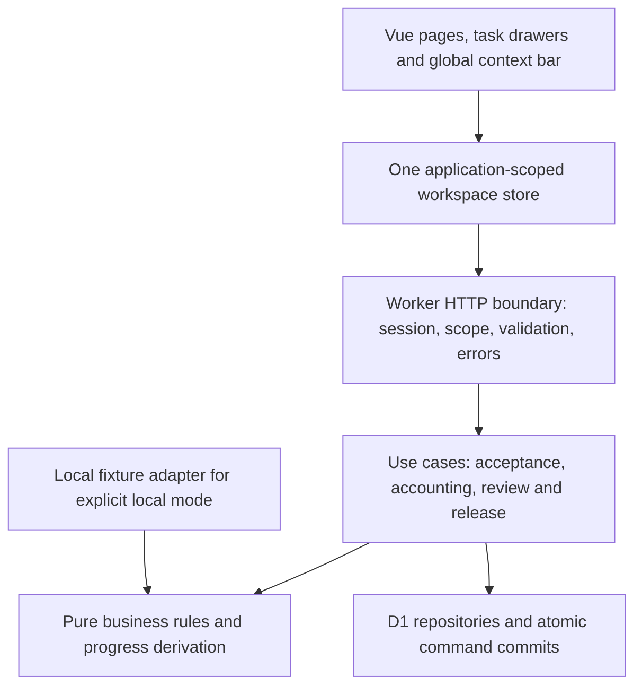

# STE AuditFlow — Unified Navigation, Shared State and Reliable Approvals

## Detailed user story and implementation guidelines

**Repository:** `nirzaf/steauditqts`  
**Branch independently checked:** `main`  
**Pinned review commit:** `390193e614e4b6dde62f053faeed50299cd3af58`  
**Commit:** `fix: harden shared demo action state`, 14 September 2026 at 20:10:48 UTC  
**Review prepared:** 15 September 2026  
**Proposed milestone:** **M7 — One Workspace, One Process State, Explicit Approval Handoffs**  
**Target stack:** existing Vue/Vite frontend, Cloudflare Pages, `steaudit-api` Worker, and the existing `quadrate-db` D1 binding.  
**Database ID:** `4a85e0dd-dddf-4ef5-9230-593d6878ada8`.

> **Verdict:** Keep the current stack and reuse the substantial prototype work. The most valuable change is to make the ordinary portal screens, the shared control room, the pipeline, and the approval queues operate on the same server-validated records. Adding more screens before fixing those connections will make the demonstration harder to trust.

### Evidence and verification boundaries

The branch still points to the same commit used in the preceding review. This document deepens that review; it does not claim that another code update was discovered. Repository observations below refer to the pinned commit, not an assumed deployment. [S01]

The review examined the routing shell, local persistence, shared polling/client, role workspaces, questionnaire and domain logic, Worker action handlers, D1 migrations, and representative tests. Existing application tests, browser journeys, Cloudflare configuration, and remote D1 contents were **not independently executed or inspected in the live environment**. The configuration file names the requested database and enables public-synthetic mode; the string `isolated-non-production` does not prove that the database is isolated from other applications. [S02]

The implementation examples later in this document are **proposed code**, not patches already applied to the repository. Their local verification is reported separately at the end. No repository changes, deployments, remote migrations, resets, or real client actions were performed.

**Source labels:** `[Sxx]` identifies reviewed repository evidence; `[B1]` identifies the supplied v5 business specification; `[Exx]` identifies current official platform documentation used for implementation guidance. Proposed architecture, acceptance criteria and code are recommendations, not descriptions of already implemented behavior.

---

## Contents

1. Goal, scope and architecture
2. Multi-portal navigation and demo impersonation
3. State management and progress tracking
4. Pipeline and process validation
5. Multi-stage approvals
6. Delivery sequence and acceptance tests
7. Concrete implementation examples
8. Verification and source register

---

# 1. Goal, scope and architecture

## 1.1 Main user story: `M7-EPIC`

**As a** presenter or participant demonstrating the audit platform,  
**I want** to switch between authorized personas and engagements, see the same persistent process state everywhere, and complete each handoff through the intended portal,  
**so that** I can demonstrate the final product without copying IDs, logging out repeatedly, manually adjusting statuses, or explaining contradictory screens.

A successful demonstration follows this pattern:

**Choose persona → choose client/service/period → see next permitted action → open the exact record → submit → see the confirmed result → hand over to the next role.**

Each action must have a visible business result, an identified next owner, and a durable event. Looking at a page, playing an animation, or acknowledging a task is not approval of the underlying work.

## 1.2 Scope and non-goals

Keep Vue/Vite, Pages, Workers, D1, the existing question banks, Decimal calculations, document definitions and useful domain tests. Preserve the original audit pipeline and all named outputs. Keep email, WhatsApp, payment verification, document protection and Microsoft/Frappe integrations explicitly simulated. [B1]

Do not introduce FastAPI, Nuxt, microservices, a second database, a generic workflow designer, a dependency-injection framework, or an automatic production-authentication redesign. Do not modify unrelated `quadrate-db` tables. The eventual Frappe/ERPNext architecture remains a separate production implementation, not a migration required to improve this demo.

Use the existing hash router initially. Centralizing route policy and context will deliver most of the benefit without a new dependency. Vue Router can be adopted later in a separate, justified change; Pinia is not a prerequisite for an app-scoped reactive store. Official Vue documentation supports a shared reactive store as a simple option. [E01]

## 1.3 Current architecture and the central problem

The application currently has three different kinds of state:

| Layer | Actual responsibility | Main issue to address |
|---|---|---|
| `src/localState.js` | Browser-local client profiles, comments, preferences and drafts; additive legacy migration | This is not the entire workflow store. Do not try to solve shared approvals by expanding this file. |
| `src/domain/scenario.js` and domain helpers | Rich browser-local engagement simulation, actors, assessments, accounting, audit and release logic | Much of the ordinary UI still calls this model even when shared mode is enabled. |
| `worker/index.js`, migrations and `src/sharedDemo.js` | D1-backed sessions, shared records and action handlers | The shared flow contains fewer business checks than the local model; it is not merely another persistence adapter for the same rules. |

For example, `RoleWorkspacePage.vue` reads local commercial/gate state and invokes local commands while also rendering a shared task queue. `EngagementsPage.vue` adds a shared timeline alongside the local timeline. `SharedDemoPage.vue` supplies a separate set of form-based shared actions. These are useful intermediate implementation steps, but they currently represent different workflows. [S03][S04][S05][S06]

**Refactoring rule:** In shared mode, every authoritative workflow read and command comes through the Worker. In local mode, the same business rules may operate on isolated fixture state. Never silently mix local approval state with a D1 task queue as though both describe one record.

## 1.4 Practical Clean Architecture

Use four small responsibilities, not four large frameworks:



The domain must not import Vue, browser storage, `Request`, `Response`, or D1 bindings. It receives plain data and returns calculations, blockers or a transition plan. Worker use cases authenticate the caller, load data, run those rules, and commit the result. Vue displays the returned projection and asks for actions; it does not decide that an audit has passed.

A small target structure is sufficient:

```text
shared/
  workflowRules.js          # Pure rules reused by shared/local modes
  questionPolicy.js        # Explicit policy keyed by existing question IDs
  actionContracts.js       # Names and payload validators, no mutable state
src/
  navigation/registry.js   # Route components and navigation metadata
  navigation/location.js   # Existing hash URL parsing and context preservation
  composables/useDemoWorkspace.js
  infrastructure/localDrafts.js
  infrastructure/commandTransport.js
  pages/                   # Existing pages retained and rewired incrementally
worker/
  index.js                 # Thin route dispatcher
  http/context.js          # Viewer, effective actor and scope checks
  application/actions.js   # Concrete use-case dispatch; not a workflow engine
  application/workspace.js # Consistent, permission-filtered read model
  repositories/d1.js       # Queries and transaction assembly
  migrations/              # Reviewed, project-scoped schema changes
```

Do not create repository interfaces or service classes for every table. Extract files only when a responsibility is being moved or tested. Preserve `decimal.js` and `canonicalize`; their existing jobs do not need replacement.

---

# 2. Multi-portal navigation and demo impersonation

## 2.1 Source-derived findings

| ID | Finding | Evidence and consequence |
|---|---|---|
| NAV-F01 | The sidebar workspace switcher is decorative; account switching returns to login. | `App.vue` renders a non-interactive workspace container; both account-menu entries use `showLogin`. Fast demonstration requires repeated login/navigation. [S07] |
| NAV-F02 | Shared scope is still anchored to Northstar audit. | `SHARED_ENGAGEMENT_ID` is hard-coded; the shared control room and pipeline consume it, while ordinary pages can select another local engagement. [S05][S08] |
| NAV-F03 | Route access and menu declarations disagree. | `roleRouteSets` gives `system-admin` an Admin Console link, but the router limits that page to `admin`. The live pipeline chooses the admin destination instead of the effective persona's destination. [S07][S09][S10] |
| NAV-F04 | The displayed actor and effective API actor can diverge. | The browser uses a locally stored persona; the Worker uses one origin-wide session cookie. Recreating that cookie for another persona can change the API actor used by another tab without updating that tab's UI. This is an architectural inference from the session design, not a live-browser test. [S07][S11][E02] |
| NAV-F05 | Some advertised actions are not executable by that persona. | The shared action list includes `admin` on Finance, EQR and client-management actions, but the Worker's admin persona does not have all those roles. Do not fix this by granting every professional role to Admin. [S05][S11] |

## 2.2 Story `NAV-01` — Global client, engagement and persona context

**As a presenter**, I want one visible context bar on every page so that changing the client or service updates the whole application.

Suggested layout:

```text
Demo run: Workshop A    Client: Northstar ▼    Service: Audit ▼    Period: FY2026 ▼
Acting as: Audit Manager ▼      Shared · Synced      Next action: Review WP-AR-01 →
```

The context is a single object containing the demo run, active generation, effective actor, client, engagement, service and reporting period. The Worker returns the allowed contexts; the frontend does not invent assignments or fall back to an arbitrary first client.

**Implementation guidelines**

Create a server endpoint for allowed contexts. It must return the Northstar audit, Northstar accounting and Cedar accounting scopes only where the current effective actor is assigned. The existing Worker assignment lists already distinguish those scopes. The initial migration seeds one shared Northstar record; the reset routine creates three, so do not describe three shared records as guaranteed in every database before inspection. [S11][S12]

Use linked accounting/audit IDs as explicit relationships. An accountant who can access Northstar accounting must not gain unrestricted audit-file access just because the service tracks are linked. Provide an authorized accounting-to-audit handoff projection instead.

**Acceptance criteria:** All headings, tasks, documents, breadcrumbs, progress and commands change together; unauthorized scopes are absent; an unknown scope yields an accessible no-access view; changing client clears the old record selection; browser Back/Forward and reload restore a valid context.

## 2.3 Story `NAV-02` — Quick-switch without hidden authority changes

**As a presenter**, I want to open another role's view in one interaction while keeping the same engagement wherever permitted.

Separate two identities:

| Identity | Meaning |
|---|---|
| Viewer / presenter | The real browser participant allowed to enter a particular synthetic demo run |
| Effective demo actor | The fictional Client, Senior, Manager, Partner, Finance or other actor whose workflow is being demonstrated |

Every event records both identities where the presentation mode allows switching. Choosing a Partner persona is **role-play in a permitted synthetic run**, not genuine authentication as a partner. Real users, tokens and professional authority are outside this demo feature.

**Recommended implementation for simultaneous tabs:** Keep the HttpOnly cookie attached to the viewer, and create one server-owned `demo_view` per tab. The view row binds viewer session → demo run → effective actor → engagement → context version. Requests carry a non-secret view ID plus expected context version; neither grants access without the parent viewer session and server-side permission check.

Proposed endpoints:

```text
POST   /api/demo/views                 Create a tab-scoped view
GET    /api/demo/views/:viewId         Read its actual server context
PUT    /api/demo/views/:viewId         Switch allowed persona/engagement
DELETE /api/demo/views/:viewId         Close this view, not all other tabs
GET    /api/demo/contexts              List permitted contexts
```

Create a new view on each tab bootstrap. Persist only preferred persona/entity selections in browser storage, not a shared bearer token or the authoritative role. Do not assume that moving a persona ID to `sessionStorage` isolates an HttpOnly cookie: session storage and cookie scoping are different, and a new window with an opener may initially copy session storage. [E02][E03]

During a switch, disable submissions, preserve or explicitly discard unsaved form text, cancel old reads, clear old entity data, await the Worker response, and then update both the UI and the route. If the response is lost, read the server view before enabling commands again. Avoid a race between App bootstrap and page-level session creation.

A smaller initial alternative is one effective actor per browser session with cross-tab switch detection and read-only warnings in old tabs; use separate browser profiles for simultaneous roles. Do not promise tab-independent switching until the view model exists.

**Acceptance criteria:** Switching does not log out; no professional command is issued under the previous actor; an old tab cannot silently change another tab's actor; a disallowed switch is rejected by the Worker; a failed switch leaves editing disabled until context is confirmed; selecting a demo role never grants presenter reset privileges.

## 2.4 Story `NAV-03` — One route registry and real record navigation

**As a participant**, I want task links and pipeline actions to open the exact record I need, not a generic page where I must copy IDs.

Retain current hash URLs and add explicit query context:

```text
#/reviews?engagement=ENG-0018-AUD-2026&record=RP-042&tab=approvals
```

Move route definitions out of the giant shell. One registry must drive the router, sidebar, search palette, breadcrumbs and stage destinations. Use a server-provided list of allowed route/action keys for the selected context. Route restrictions remain a convenience; the Worker independently authorizes each read and write.

Replace the shared control-room free-text IDs and string booleans with scoped record selectors, choice controls and exact-version previews. Client acceptance is a button on an EL or Draft-FS record; EQR approval is an action on a candidate, not a field where a presenter types `v01`.

Retain the control room for Presenter/QA, but move normal work onto the ordinary portal pages. Hide unsupported actions or explain their owner and prerequisite. Search should return client/engagement/task/document results; the current top-level search only redirects to another page. [S07]

**Acceptance criteria:** Every visible menu item is authorized and opens; task links preserve engagement and record; switching role keeps the current route only when permitted; hidden routes do not become accessible through direct hashes; no quick-switch path silently drops an unsaved draft.

---

# 3. State management and progress tracking

## 3.1 Source-derived findings

`localState.js` already handles unavailable storage and keeps the original v1 value during migration. Preserve that behavior. However, normalization overwrites the version with v2 and accepts broadly shaped arrays/objects; it does not distinguish unknown future schemas or validate every stored item. Its records are primarily engagement-scoped, not scoped by demo generation and actor. [S03]

The shared poller creates three requests per instance: engagement, tasks and timeline. The shared control room mounts its own poller and three widgets that each create another poller. That structure can create **12 requests per refresh interval** before extra artifact/outbox/PBC reads. Each resolved session also attempts a D1 activity update. This is derived from the component call structure, not a measured live request rate. [S05][S06][S10][S11]

After an initial successful load, the poller can suppress later engagement errors while still updating `lastSync`. It does not protect against an older request overwriting newer-context data. The role workspace also reads `actor.role` for its shared task filter, but scenario actors have `roles` and `personaId`, not a `role` field; the filter therefore resolves to an empty string. [S06][S04][S13]

## 3.2 Story `STATE-01` — One authoritative workspace snapshot

**As a participant**, I want every screen to show the same committed state, regardless of which portal performed the action.

Create one app-scoped Vue store using `provide/inject` plus `reactive`/`readonly`. Instantiate it once in App; child widgets consume it without starting their own polling cycles.

The Worker should return a permission-filtered snapshot for the active view:

```text
GET /api/engagements/:id/workspace
```

Suggested response contract:

```json
{
  "viewId": "server-view-id",
  "contextVersion": 4,
  "actorId": "ACT-OMAR",
  "engagementId": "ENG-0018-AUD-2026",
  "generationId": "gen-workshop-04",
  "revision": 27,
  "mode": "SHARED",
  "scope": { "clientId": "CLI-0018", "service": "AUDIT", "period": "FY2026" },
  "progress": {},
  "tasks": [],
  "approvalSummary": {},
  "notifications": [],
  "recentEvents": [],
  "allowedActions": [],
  "blockers": []
}
```

The example has no invented completion percentage. The server calculates actual counts from applicable required records; lists must carry pagination and aggregate counts separately.

Load a consistent server snapshot. A set of unrelated reads can observe different revisions. A bounded D1 read batch is appropriate; an alternative is reading the guard revision before and after the related queries and retrying on change. Where D1 read replication is used, session bookmarks support sequential consistency, but they do not replace business revision checks. [E04]

In shared mode, use that snapshot in Clients, Engagements, Accounting, Audit, Reviews, Release, Artifacts and the role workspace. A page not yet connected should be visibly read-only or explicitly local, never an authoritative-looking local editor next to a live D1 queue.

**Acceptance criteria:** A confirmed action appears in the actor's screen immediately from its response/readback; another visible browser refreshes within the configured polling interval under healthy conditions; all stage and approval widgets agree on scope and revision; read-only explanatory fixtures are distinguishable from live records.

## 3.3 Story `STATE-02` — Race-safe polling and honest status

Use one refresh controller per active application view. Coalesce duplicate refresh requests, schedule the next poll after the previous finishes, pause when hidden, and refresh when visible. Cancel requests on context changes and also compare a request epoch because not every asynchronous operation honors cancellation.

Keep separate states: `LOADING`, `READY`, `REFRESHING`, `STALE`, `ERROR`, and `RESET_REQUIRED`. Only advance `lastSuccessfulSync` after a valid, coherent response. Retain last-good data on transient failure, but label it stale and disable version-sensitive approvals until refreshed.

A response from an older engagement, view version or generation cannot update the active UI. A poll started before a successful command cannot replace revision 28 with revision 27. On reset, clear the active projection, preserve the old draft under its old generation, and explicitly reconnect before further commands.

Do not write `last_activity` on every read. Throttle it, use a bounded background update when appropriate, or record meaningful activity on commands. This avoids turning every display refresh into multiple writes.

**Acceptance criteria:** Slow requests do not overlap indefinitely; entity A cannot flash over entity B after a switch; failed refreshes do not display a new success timestamp; one page produces one coordinated refresh cycle; old-generation commands are rejected even if the new generation reused revision 1.

## 3.4 Story `STATE-03` — Local drafts, not local approvals

**As a participant**, I want form text to survive a refresh without confusing an unsent draft with a committed business action.

Use separate storage keys for drafts and presentation preferences. Scope drafts by:

**demo run + generation + actor + engagement + form/record**.

Persist only explicitly allow-listed draft fields with `baseRevision`, schema version and saved timestamp. Never persist passwords, authentication tokens, final approval authority, complete internal snapshots, or gate status in this draft layer.

When opening a draft over a changed server revision, show a comparison/reconciliation prompt. Do not automatically resubmit it. Retain unsupported/corrupt legacy data for manual recovery rather than coercing it into the current shape and reporting success.

Keep the old v1/v2 reader for explicit migration. Legacy unscoped comments and preferences need a documented ownership mapping or a read-only legacy view; do not distribute them to every persona. A storage failure must stay visible to the form.

**Acceptance criteria:** Refresh restores permitted text; a new persona does not inherit another actor's draft; a reset does not replay old decisions; malformed data is not overwritten silently; local save is labelled `SAVED_LOCAL_DRAFT`, never `COMMITTED`.

## 3.5 Story `STATE-04` — Visible account, evaluation and approval progress

The context bar and workspace should show three distinct concepts:

| Indicator | Meaning |
|---|---|
| Work progress | Required tasks/records completed out of applicable requirements |
| Approval readiness | Required decisions current for the selected versions |
| Process integrity | Whether persisted records contradict required invariants |

A waiting engagement can be perfectly valid. Display **Integrity: Passed; Readiness: Waiting for Manager**, not “Invalid” merely because work remains. Conversely, a release based on an unrelated EQR version is an integrity failure, not just incomplete work.

Use the 8-stage view for orientation and G0–G10 for the detailed controls. Preserve v5 gate meanings. Exclude the next-period continuance permission from current-period completion denominators; treat inapplicable service gates explicitly rather than counting them as passed. [B1]

Accounting progress should show: source received → row validation → mapping → reconciliations → journal decisions → FS package → independent technical review → management decision → versioned audit handoff. Client evaluation should show answered, evidence verified, unresolved reviews and current partner decision separately.

The notification bell, open-task counters, portfolio rows and “Next action” all come from the same projection. Include exact target/route and next owner, not just a generic role label.

---

# 4. Pipeline and process validation

## 4.1 Confirmed gaps and important edge cases

These are source-level findings. They were not exercised against the public demo.

| ID | Finding | Specific correction |
|---|---|---|
| PIPE-F01 | `SharedPipelineStatus` marks earlier stage indices complete; commercial close marks every stage complete. | Derive each gate independently from evidence. Animation position and commercial close must not imply audit readiness. [S10] |
| PIPE-F02 | Shared `ACCEPT_CLIENT` checks partner role, decision/rationale and optional revision, but not the full assessment. | Persist assessment responses and run the same pure evaluator in the Worker. [S14] |
| PIPE-F03 | Local questionnaire rules parse English strings such as `Yes =`/`No =`; continuance records use `trigger`, not that `rule` syntax. | Maintain typed policy per question/template version. Do not parse prose to decide a hard stop. [S15][S16] |
| PIPE-F04 | Favorable answers can be counted even without verified evidence; verified positive-risk answers can suppress follow-up. | Evidence verification and specialist disposition must be separate requirements tied to the response revision. [S15] |
| PIPE-F05 | A confirmed prohibition causes `recordPartnerDecision` to reject before distinguishing Accept from Decline/Escalate. | Block favorable approval but allow a documented decline or escalation. Never require clearing a genuine prohibition merely to record a refusal. [S15] |
| PIPE-F06 | `NOT_APPLICABLE` skips the question after a rationale; there is no complete typed applicability policy. | Require approved applicability and jurisdiction/service policy; a rationale alone must not waive a mandatory control. [S15] |
| PIPE-F07 | Shared temporary-credential issuance checks verified advance but not all v5 onboarding conditions. Shared advance verification can create a commercial row with a fixed amount. | Require current G1–G3, exact terms, required allocated advance, correct client contact and authorized workspace; model “advance not required” explicitly. [S14][B1] |
| PIPE-F08 | Shared TB recording accepts caller-supplied totals/status/mapping flags, permits zero rows, and compares money strings. Same-version upsert overwrites source data. | Parse bounded source rows or a known server fixture, normalize amounts, check entity/period/currency, derive flags and preserve immutable source versions. [S17] |
| PIPE-F09 | Shared Draft-FS publication and opinion entry have much weaker prerequisites than the local audit chain. | Add required workpaper/accounting/management/manager gates before the appropriate transitions. [S18] |
| PIPE-F10 | Reviewing an older PBC receipt can set the parent request to Accepted after a newer replacement exists. Clarification notes are validated but not durably stored by that handler. | Store a decision against a receipt ID/version, preserve the note, and derive parent readiness from the current effective receipt. [S17] |
| PIPE-F11 | Several optional revisions, count-based versions and multi-statement writes permit races or partial state. | Require expected generation/revision and atomic command commits, not optimistic UI status changes. [S14][S17][S18] |
| PIPE-F12 | The local professional-only response check rejects `client_finance` specifically rather than positively requiring an authorized professional role. | Use explicit allowed roles per question; a different active role must not bypass the restriction simply because it lacks `client_finance`. [S15] |

**Question-count clarification:** The acceptance bank contains **62 entries with sparse IDs ending at `CE-093`**, not 93 questions. Continuance has 30 entries. Compute displayed counts from the selected template and applicability, not from the maximum ID or a copied label. The existing question wording and identities should remain unchanged unless an explicit requirement change is approved. [S16][B1]

## 4.2 Story `PIPE-01` — One pure validator used for display and enforcement

**As a presenter**, I want the same rule that explains a blocked button to reject the corresponding API call.

Implement one pure rule module returning structured results:

```text
allowed
blockers: code, safe message, responsible role, target record
warnings: non-blocking items
nextActions: action key, exact target, required role
```

Use it from both the workspace projection and command execution. The frontend may display server-returned allowed actions but must not replace Worker validation with a local check. Unknown policy, missing required input, an unregistered transition, or an incomplete read model fails closed.

Separate four validation layers:

1. **Request:** bounded JSON, known action, required IDs and expected versions, allowed enums and numeric formats.
2. **Authority:** verified viewer/session, active tab view, permitted effective actor, assignment and action-specific capability.
3. **Business:** typed questionnaires, dependencies, approval applicability, record state and service-specific rules.
4. **Commit:** database-enforced generation/revision and uniqueness checks for all touched dependencies.

Do not add a generic workflow engine. A concrete action registry with ordinary functions is enough.

## 4.3 Story `PIPE-02` — Shared client evaluation and continuation

Persist assessment instance, response history, evidence references and follow-up dispositions in D1. Reuse the existing question bank by ID/template version. Store policy metadata separately from human-readable wording.

A policy entry should state allowed answers, who may answer, when verification is required, who may verify, applicability conditions and which follow-up is required. A response change invalidates its old verification/disposition. Partner acceptance is bound to the current assessment content revision, not just the fact that someone once pressed Accept.

Important demonstration cases:

- Missing UBO evidence blocks favorable acceptance.
- A possible match creates a specialist task without making an automatic legal finding.
- A confirmed prohibition prevents Accept/Continue but permits Decline with rationale.
- A verified answer reporting a risk still needs the specifically required disposition.
- A permitted, reviewed N/A is different from unanswered or waived.
- Changed independence facts reopen evaluation and invalidate dependent permissions.
- New-year continuation copies reference facts, not current-year approval.

These are software requirements derived from the existing specification and rule catalogue, not a new legal or professional policy. Policy meaning must be approved by the firm's designated owner. [B1][S15][S16]

**Acceptance criteria:** The UI and direct Worker commands yield the same blocker codes; compliance updates appear to the Partner in the shared view; a client cannot modify internal professional questions; there is a navigable task for every unresolved follow-up; an assessment re-answer makes the prior acceptance visibly stale.

## 4.4 Story `PIPE-03` — Accounting controls and dependency invalidation

Use D1 for the shared accounting package's current source pointer, source revision history, mappings, reconciliation status, journal decisions, FS versions and approval references. A compact status projection is useful, but it must be derived from those underlying records rather than become another collection of editable flags.

For a bounded synthetic demo, the existing 14-row fixture is enough to prove correct behavior. Calculate totals and mapping coverage from actual fixture/import rows on the Worker using existing Decimal utilities; do not accept `mappingComplete: true` as proof. Normalize `100`, `100.0` and `100.00` as the same amount while preserving source account codes as strings. Reject missing source identity, zero-row “validated” sources and mismatched entity/period/currency.

Do not overwrite an approved source version on re-upload. Append a new source and preserve its relationship to the previous source and reflected journals. An authorized journal rejection must remain a recorded rejection, not a disappearance or implicit posting.

On accounting changes, increment the accounting revision and invalidate the linked audit dependency **in the same commit**. Bind manager review, Partner review, EQR and opinion to candidate content identity, evaluated input generation and policy version. A comment-only edit should not invalidate the entire audit unnecessarily; distinguish data/content dependencies from presentation metadata.

**Acceptance criteria:** Source replacement makes affected approvals stale; the old versions remain inspectable; a reflected adjustment cannot be counted twice; management authorization and technical review are separate; a successful accounting-only engagement does not need an audit opinion or EQR unless its service policy actually requires one.

## 4.5 Read-only process inspection versus scenario mutation

“Validate pipeline” should inspect current invariants without changing approvals or inserting fabricated records. Display actionable blockers and allow navigation to the correct role's record.

A scenario preset is a separate presenter command that creates a new, clearly labelled synthetic run. It must not silently change `current_stage` to “Ready for Release.” Use versioned fixture recipes, preserve the prior run, and record which preset was loaded. Tests that deliberately corrupt state belong in disposable local test data, not the shared live demo.

---

# 5. Multi-stage approvals

## 5.1 Source-derived findings

| ID | Finding | Why it matters |
|---|---|---|
| APP-F01 | EQR accepts a caller-supplied candidate string without checking a matching candidate. Release checks the latest EQR is Approve, not that its target matches the opinion/current FS. | An old or unrelated approval can satisfy the shared release check. [S18] |
| APP-F02 | Shared release does not require a current accepted client Draft-FS response or an explicit Manager completion/Partner completion handoff. | The UI can demonstrate a shortcut that does not represent v5. [S18][B1] |
| APP-F03 | Significant-review clearance checks the review-point author, falling back to the workpaper submitter only when author is absent. | It can block the reviewer who raised the question while failing to check the actual responder/preparer. [S18] |
| APP-F04 | Decision lookups order by timestamps; source/FS versions also use counts or strings. | Same-second decisions and long version sequences need stable integer ordering and explicit current pointers. [S18] |
| APP-F05 | Most writes are separate `run()` calls, not one transaction; idempotency checking is not uniform. | A later event-insert failure can leave the business update committed. The unique event key also treats an empty string as a real key. [S12][S14][S18] |
| APP-F06 | `sharedDemo.js` reports network failure as “not committed,” and the control room creates a new idempotency key on every click. | A lost response can follow a successful commit; clicking again can duplicate work. [S05][S08] |
| APP-F07 | Invoice IDs are derived from the last four digits of engagement IDs; the shown engagements all end in 2026. Advance deduction uses the required amount, not a verified allocation ledger. | Multi-entity invoice identification and balances can be misleading. [S18] |

## 5.2 Story `APPROVAL-01` — A unified approval center

**As a Manager, Partner, client-management user or other approver**, I want a single role-filtered queue of exact records requiring my decision.

Retain the existing Reviews screen and enhance it before adding another competing review page. Provide tabs for **My decisions**, **All permitted stages**, **Returned work**, and **Stale approvals**.

| Decision | Responsible user | Required target |
|---|---|---|
| Acceptance / continuation | Partner after evaluation/clearances | Assessment version |
| Fee approval | Named configured commercial approvers | Estimate and fee version |
| EL acceptance | Client Management | Issued EL version |
| Plan approval | Manager/Partner per policy | Audit plan version |
| Evidence suitability | Assigned reviewer | Exact PBC receipt |
| Accounting technical review | Independent accounting reviewer | Accounting package version |
| Management journal/FS decision | Authorized client approver | Exact journal/package |
| Manager completion | Audit Manager | Submitted audit-file/candidate manifest |
| Partner completion review | Partner | Manager handoff/candidate |
| EQR | Assigned quality reviewer, where required | Exact candidate and report/FS dependencies |
| Audit opinion | Partner | Supported candidate and reporting basis |
| Final client discussion | Authorized engagement owner | Candidate/issues discussed |
| Release authorization | Partner/signatory | Final report/FS pair |
| Checkpoint / archive | Records custodian | Release event and protected artifact manifest |
| Commercial close | Finance | Invoice, actuals and advance allocations |

Each item shows current target version, submitted by, current owner, decision history, rationale, status, and why a historical approval is stale. Client-facing views must not disclose internal deliberation merely because an engagement ID matches.

The Worker currently returns broad task/timeline/outbox data for an assigned engagement. New DTO projections must filter recipient, visibility and action policy server-side, including counts and search results. The legacy comments/profile/preference routes also need the same session/scope enforcement; an outer synthetic flag is not sufficient. `getDemoMe` should not serialize the private session ID contained in its internal session object. [S11][S14]

## 5.3 Story `APPROVAL-02` — Explicit handoff and correction loops

Add shared commands for the missing transitions, rather than using acknowledgements or free-text stage changes:

```text
SUBMIT_AUDIT_FILE
RECOMMEND_COMPLETION / RETURN_TO_TEAM
REVIEW_PARTNER_COMPLETION / RETURN_TO_MANAGER
RECORD_FINAL_DISCUSSION
VERIFY_RELEASE_CHECKPOINT
ASSEMBLE_ARCHIVE
```

Keep command names concrete and ensure each has an API contract, role rule, prerequisite rule, persisted record/event and real UI action.

The normal audit path is:

**Senior submits file → Manager reviews → Partner reviews → required quality review → supported opinion/finalization → final discussion → release event → independent checkpoint → delivery → archive.**

Formation of a draft opinion may occur before final EQR completion under the approved workflow; distinguish drafting from final dating/signing/issuance. Do not create a circular prerequisite where a release event requires a checkpoint that itself requires that release event. Preserve the v5 checkpoint-before-delivery boundary. [B1]

A returned item creates a correction task and records the reason. A resubmission is a new content revision. Acceptance of an older revision does not satisfy the new one. Corrected work, intentionally uncorrected findings and matters carried forward must be represented according to the configured business policy, not all forcibly marked fixed.

For separation of duties, check the subject preparer, response author and assigned reviewer. The person who raised a review question may be allowed to clear a response from someone else; “review-point author” is not a substitute for “preparer of the work being reviewed.” Preserve any stricter configured policy explicitly.

## 5.4 Story `APPROVAL-03` — Atomic, idempotent and responsive commands

Use one command envelope for all shared workflow writes:

```json
{
  "action": "RECOMMEND_COMPLETION",
  "targetId": "candidate-id",
  "expectedGenerationId": "gen-workshop-04",
  "expectedContextVersion": 4,
  "expectedRevision": 27,
  "idempotencyKey": "one-key-for-this-user-intent",
  "payload": { "decision": "RECOMMEND_COMPLETE", "rationale": "Reviewed the submitted package." }
}
```

The actor, role, record owner and assignment come from the Worker context, not fields in this body. Reject unknown protected fields. Bound request sizes in UTF-8 bytes, not JavaScript character count; validate enums, source identities and dates before touching D1.

**Execution order**

1. Resolve the viewer, tab view, current effective actor and scope; verify origin/CSRF policy for cookie-authenticated mutations.
2. Validate the command envelope and active generation/context version.
3. Look up an authorized receipt by generation + engagement + actor + idempotency key. A changed payload with the same key is a conflict. Never return another actor's result.
4. Load the current aggregate and related guards; run action-specific business validation.
5. Commit the decision, exact target binding, revision, related task changes, event, receipt and outbox intents in **one D1 batch**.
6. Return confirmed outcome and the updated authorized projection; refresh other visible sessions through the existing polling interval.

D1 `batch()` provides transaction semantics and rolls back the batch when a statement fails. A zero-row conditional `UPDATE` is not itself a statement failure: checking `meta.changes` only after later statements executed does not make those statements conditional. The example below uses a database constraint to fail a stale claim before dependent writes. Do not implement `BEGIN`/`COMMIT` across awaited independent Worker calls. [E04]

Every mutation of a guarded aggregate must increment its revision. Include linked accounting guards and policy/permission changes; otherwise a perfectly atomic transaction can still approve a stale business snapshot. Actor disablement or assignment change must invalidate affected view versions, and those versions must be rechecked in the commit guard.

Store a normalized payload digest using existing canonicalization utilities. Scope receipts to the actor and generation. Keep real secrets and one-time credential plaintext out of receipt/event JSON.

**Snappy UI:** Show `Submitting` immediately, prevent duplicate clicks, then replace the affected projection with the confirmed response. Do not optimistically mark Partner approval or release as completed. Harmless presentation changes can be optimistic; professional state cannot.

### Lost-response rule

A timeout means **outcome unconfirmed**, not necessarily failure. Retain the same immutable command payload and idempotency key. Reconcile its receipt or retry that same intent. Do not create a new key on every retry, and do not automatically rebase a failed approval onto a newer revision.

Use these distinct outcomes:

- `COMMITTED`: confirmed durable result, including a confirmed idempotent replay.
- `REJECTED`: authoritative validation/permission/revision rejection with no committed mutation.
- `UNCERTAIN`: timeout, malformed response or unconfirmed server result; reconciliation required.

If the response is HTML from an SPA fallback or JSON without a valid command outcome, it is not success.

## 5.5 Story `APPROVAL-04` — Safe demo runs, records and finance completion

Continue using `quadrate-db`, but protect other applications and concurrent presentations. All new schema objects must be project-prefixed. Table naming is organizational separation, not a database security boundary.

Prefer a new demo run/generation and an atomic active-run switch over deleting every known engagement's data. Use per-run engagement IDs or an explicit run-scoped schema so two presenters cannot reset each other's exercise. Existing reset performs a sequence of deletes and seed writes; stale open commands carry no universal generation guard. Migrate carefully and preserve prior records until a separately authorized cleanup. [S12][S14]

Presenter reset permission belongs to the verified viewer/demo host, not to the effective Partner persona chosen for role-play. Public-synthetic visitors should use bounded isolated runs; shared host-controlled workshops should use a verified outer access boundary. The existing presence check for Access headers must not be mistaken for cryptographic JWT validation. Follow official validation guidance when using Access. [S02][S11][E05]

For Finance, record individual approved time entries and rate snapshots or clearly label entered summary actuals. Calculate cost and remaining balance from verified allocations. Distinguish money required, received, verified and allocated. Preserve zero-advance and overpayment/credit scenarios. Generate collision-resistant invoice IDs scoped appropriately, not an ID derived solely from a year suffix.

Create inspectable synthetic document content from a frozen rendering payload, not just a title. Bounded HTML/JSON content can demonstrate an exact quote, EL, Draft FS and invoice; persisting arbitrary real binary files is a separate R2 story. Metadata alone is not proof that an original file can be reopened. Email/WhatsApp outbox state remains explicitly simulated.

**Acceptance criteria:** New-run reset does not affect another run or unrelated tables; old-generation approvals fail; shared release does not skip checkpoint/delivery ordering; invoice replay does not create duplicate messages; required advance is not subtracted unless actually allocated; the Client sees the issued invoice and permitted report/FS versions only.


---

# 6. Delivery sequence and acceptance tests

## 6.1 Incremental implementation plan

| Slice | Work | Exit condition |
|---|---|---|
| 0. Freeze and reproduce | Pin the starting commit, inventory current routes/roles, add focused failing tests for the verified gaps. Preserve current useful tests. | Known failures can be reproduced locally without changing remote data. |
| 1. Context and transport | Add viewer/tab context, route registry, generation/version envelope and common command error contract. | One role/context switch works across the shell and rejects stale commands. |
| 2. Shared workspace | Add the single read projection/store; remove duplicate polling; connect Clients/Role Workspace first. | No mixed local/shared approval state on the migrated screens. |
| 3. Acceptance vertical slice | Persist questionnaire responses, typed policy/dispositions and Partner decision through the shared use case and atomic receipt mechanism. | Client/compliance/Partner can complete or decline the same evaluation through their normal portals. |
| 4. Accounting and audit slice | Connect TB/mappings/journals, PBC, workpapers, review responses and exact-version handoff. | Accounting changes immediately make affected audit approvals stale. |
| 5. Completion slice | Manager/Partner completion, EQR, final discussion, exact report/FS release, checkpoint, delivery, invoice and archive. | One audit engagement completes through the intended roles without using the pre-seeded accounting-only release as a substitute. |
| 6. Presentation and verification | Search, notifications, portfolio, “next action,” safe presets and browser tests. | The complete demonstration runs without typing IDs or opening developer tools. |

Implement one migrated command end to end before extracting every existing command. Keep changes scoped. Do not add multiple competing stores or a second copy of the business rules while “cleaning up” the architecture.

## 6.2 File-level changes

| Existing file | Recommended change |
|---|---|
| `src/App.vue` | Extract route registry; provide one workspace store; mount a real context switcher; stop creating persona cookies from multiple component lifecycles. |
| `src/auth.js` | Retain local persona fixtures for explicit local mode; shared mode reads the effective actor from the server view. No shared-session identity from localStorage. |
| `src/roleWorkspaces.js` | Keep role help and labels; generate visible navigation from common registry/context permissions instead of a competing access list. |
| `src/localState.js` | Preserve legacy read/migration behavior; reject unsupported schemas; isolate new form drafts instead of making this the shared workflow database. |
| `src/sharedDemo.js` | Add view/generation/version headers and strict outcome validation; keep one key per intent; distinguish uncertain commits. |
| `src/composables/useSharedEngagement.js` | Replace per-widget polling with the app-scoped workspace controller; preserve a temporary compatibility wrapper if needed, then remove it. |
| Shared pipeline/tasks/timeline components | Become presentation components consuming injected state or props; add exact-record navigation. |
| `src/pages/SharedDemoPage.vue` | Retain Presenter/QA access, use the same command transport and normal business forms; no separate validation catalogue. |
| `src/domain/assessments.js` | Separate pure evaluation from mutation, time generation and actor lookup; replace prose-derived policy. |
| `src/domain/scenario.js` | Retain fixture creation/local adapter; gradually delegate pure rules to shared modules. Do not rewrite unrelated simulator features. |
| `worker/index.js` | Keep request routing; extract authenticated context, use cases, read-model projection and D1 commit assembly. |
| `worker/migrations/` | Add project-scoped view/receipt/assessment/target-binding support after inspecting the real existing schema. No destructive whole-database setup scripts. |
| Tests and documentation | Add real local D1 transaction tests and browser role/context tests; record what was actually executed, not just catalogue IDs. |

## 6.3 Schema guidelines

Reuse existing tables where they fit. Likely additions are tab-scoped demo views, durable command receipts, assessment instances/responses/dispositions, candidate manifests and exact decision-target bindings. Add a run model only as needed for concurrent isolated presentations. Add granular accounting/time/journal tables when those individual actions become interactive, not speculative tables for every eventual production feature.

Version-sensitive records need a stable ID, integer content revision, generation, immutable submitted payload/hash and a current pointer. Decisions need target ID/version/hash, decision kind/result, effective actor, viewer context, rationale, policy version, input generation and server sequence. Keep response revisions and verification revisions distinct.

Add unique constraints for intent identity and business identity; they solve different problems. Two requests using different idempotency keys must still not issue the same candidate twice. Link final report and final FS to one release ID. Preserve historical decisions when their applicability changes.

Inspect migration status and take the approved backup/export before any future remote change. Existing v1/v2 browser state and any pre-existing D1 data must have an explicit migration policy. A local migration test does not authorize a remote migration; irreversible operations require the user's specified confirmation process.

## 6.4 Required regression coverage

The representative Worker tests use SQL-string-matching fake databases. These are useful unit tests, but do not execute real indexes, constraints, transaction rollback or SQLite ordering. In the reviewed release test, the fixture reaches opinion without a complete business pipeline. Keep these tests, but add actual local D1/Miniflare coverage and normal-portal browser journeys. [S19]

| Test ID | Scenario | Required outcome |
|---|---|---|
| NAV-T01 | Switch Client → Manager → Partner on the same authorized engagement. | Context stays correct; no logout; permitted page/record retained. |
| NAV-T02 | Switch to Cedar while a Northstar request is still loading. | Old response cannot overwrite Cedar; old record ID is cleared. |
| NAV-T03 | Two tabs select different personas. | Each uses its own view; cookie/view mismatch cannot perform a hidden actor switch. |
| NAV-T04 | Open every visible route and task link for each persona. | No menu/router disagreement or admin-destination fallback. |
| NAV-T05 | Tamper with view, actor, engagement or direct hash. | Worker denies unauthorized access, including metadata/counts. |
| STATE-T01 | Multiple widgets request a refresh together. | One coordinated fetch, not independent polling cascades. |
| STATE-T02 | The next poll fails after a successful load. | Last success time remains unchanged; stale state is visible. |
| STATE-T03 | Command returns revision 28 after a poll started at 27. | Delayed revision 27 never overwrites the confirmed result. |
| STATE-T04 | Reset occurs while old approvals are open. | Old generation fails; drafts remain separate and unsent. |
| STATE-T05 | Storage is full, malformed or from an unknown schema. | Visible diagnostic; no silent overwrite or false save. |
| EVAL-T01 | Favorable answer lacks required verified evidence. | Favorable acceptance blocked. |
| EVAL-T02 | Positive-risk answer is marked verified without disposition. | The specific follow-up remains required. |
| EVAL-T03 | Confirmed prohibition; Partner selects Decline. | Decline recorded; Accept/Continue denied. |
| EVAL-T04 | Mandatory control marked N/A with a sentence. | Rationale alone does not waive required policy. |
| EVAL-T05 | Relevant response changes after acceptance. | Verification and dependent decision applicability become stale. |
| ACCOUNT-T01 | Equivalent money strings and leading-zero account IDs. | Numeric normalization is correct; IDs remain strings. |
| ACCOUNT-T02 | Zero rows, wrong period or fabricated mapping flag. | Source cannot become validated/approved. |
| ACCOUNT-T03 | Replacement TB contains an already reflected adjustment. | No duplicate adjustment; prior source retained. |
| ACCOUNT-T04 | Accounting changes after manager/EQR/Partner review. | Exact affected approvals stale immediately. |
| PBC-T01 | Receipt v2 replaces v1; reviewer accepts v1 afterward. | v2 readiness is not silently satisfied by v1. |
| PBC-T02 | Clarification sent, client replaces evidence. | Note and history persist; correct tasks reopen/complete. |
| APPROVAL-T01 | EQR approves an unrelated candidate/version. | The current release remains blocked. |
| APPROVAL-T02 | Missing Manager completion, current client response or Partner review. | Relevant finalization transition blocked. |
| APPROVAL-T03 | Work preparer/responder tries to clear own significant issue. | Denied; permitted independent reviewer can complete the loop. |
| APPROVAL-T04 | Approve and Return occur in the same second. | Stable server sequence determines current decision. |
| APPROVAL-T05 | Two sessions approve/change the same revision concurrently. | One valid commit; the other receives conflict or identical replay. |
| APPROVAL-T06 | Failure occurs after decision insertion but before event/outbox write. | Entire transaction rolls back. |
| APPROVAL-T07 | Same intent is retried after the response was lost. | Same receipt/result; no second decision or notification. |
| APPROVAL-T08 | Same key reused with changed payload or a different actor. | Conflict or inaccessible receipt; never another actor's replay. |
| APPROVAL-T09 | Missing key on two successive actions. | Both rejected before mutation, not late unique-index errors. |
| RELEASE-T01 | Attempt delivery without the exact release checkpoint. | Delivery blocked without creating a circular release prerequisite. |
| FINANCE-T01 | Three FY2026 engagements produce invoices. | Distinct invoice identities; correct engagement attribution. |
| FINANCE-T02 | Advance is required but not verified/allocated. | It is not deducted as if paid. |
| SECURITY-T01 | Client requests internal tasks/outbox/legacy profile endpoints. | Server-side visibility/assignment filtering applies consistently. |
| SECURITY-T02 | Fake Access headers without verified access; public role-play mode. | Protected mode rejects fake identity; public mode is bounded to authorized synthetic runs. |
| DEMO-T01 | Complete the full user pipeline on one audit engagement. | All portals agree; no internal console ID entry or hidden state manipulation. |

Current Cloudflare documentation provides a local Workers testing integration and D1 migration recipes. Select versions compatible with the repository's lockfile, and keep new test dependencies scoped; do not migrate the whole test suite merely to add a few transaction tests. [E06]

## 6.5 Final user-acceptance demonstration

A presenter must be able to run the following without developer tools:

1. Client submits business details through the limited intake view. Compliance resolves a required evidence question; Partner sees the shared evaluation and accepts.
2. Finance prepares the staff-level estimate; configured approvers approve the fee; the exact quotation/EL is visible to Client Management; the client rejects once, then accepts a revised letter.
3. Finance verifies/allocates the required advance; authorized access controller issues simulated setup credentials; client activates only the eligible portal scope.
4. Senior prepares the plan, Manager approves, and the announcement reaches the client. Client supplies TB/PBC evidence, including one hard-copy option and one replacement after clarification. Senior and Manager see their appropriate notifications.
5. Accountant/preparer completes source validation, mapping and journal decisions. Required workpapers and conclusion summary are submitted. Draft FS and Management Information Request reach the client; a rejection produces a genuine correction loop.
6. Manager and Partner review the current package. EQR evaluates the right candidate when required. The Partner records the opinion and final discussion; the exact report/FS release is checkpointed before delivery.
7. Client opens the permitted final outputs. Finance reviews actuals, applies verified advance allocations and issues a unique invoice; Email/WhatsApp simulation is visible. Records assembles the archive without implying that commercial close is archive verification.
8. Presenter switches to Cedar accounting. The different service has its own applicable process and does not inherit Northstar's audit conclusions. A safe new demo run does not overwrite the completed exercise.

The pipeline must show both the positive path and the deliberate rejection/clarification/stale-approval paths. Showing only a happy-path animation is insufficient.

---

# 7. Concrete implementation examples

## 7.1 How to use these examples

These are bounded reference implementations for the refactoring seams, not a generated replacement repository. File paths under this section are proposed. Map them into the structure above and keep existing import conventions consistent.

The pure navigation, draft, refresh, release-rule, envelope and command-transport examples have focused local tests. The D1 batch SQL was also executed against a local compatible SQLite schema. The Vue wrapper was syntax-checked, not mounted in a browser. Worker authentication, complete action policies, real D1 migrations and all production integrations still require implementation and integration testing.

The proposed view endpoints and `/workspace` contract do **not** exist at the reviewed commit. Implement them before switching ordinary pages to the new store. Treat all server-normalized snapshots as outputs of repository/projection code, not as trusted JSON supplied by a browser.

## 7.2 Routing: preserve existing hash URLs and validate scope

Extract the existing `routes` components from App into a registry first. Use the following pure helpers for navigation, including direct hashes and Back/Forward. Keep invalid/unassigned contexts out of the UI; there is no default-to-Admin escape hatch.

**Suggested destination:** `src/navigation/location.js`

```javascript
// Pure helpers. Keep the existing hash URLs; no router dependency is required.
const ID = /^[A-Za-z0-9_-]{1,80}$/;
const TAB = /^[A-Za-z0-9_-]{1,40}$/;

export function decodeLocation(hash) {
  const url = new URL(String(hash || '').replace(/^#\/?/, ''), 'https://demo.invalid/');
  const routeKey = url.pathname.replace(/^\//, '').split('/')[0] || 'role-workspace';
  const safe = (name, pattern) => {
    const value = url.searchParams.get(name);
    return value && pattern.test(value) ? value : null;
  };
  return {
    routeKey,
    engagementId: safe('engagement', ID),
    recordId: safe('record', ID),
    tab: safe('tab', TAB),
  };
}

export function encodeLocation({ routeKey, engagementId, recordId, tab }) {
  if (!ID.test(routeKey || '')) throw new TypeError('Invalid route key.');
  const query = new URLSearchParams();
  for (const [name, value, pattern] of [
    ['engagement', engagementId, ID], ['record', recordId, ID], ['tab', tab, TAB],
  ]) {
    if (value != null) {
      if (!pattern.test(String(value))) throw new TypeError(`Invalid ${name}.`);
      query.set(name, String(value));
    }
  }
  return `#/${routeKey}${query.size ? `?${query}` : ''}`;
}

export function resolveLocation(requested, view, registry) {
  // view comes from the Worker. A URL selects a resource, never grants access.
  const contexts = view.contexts || [];
  const selected = contexts.find(c => c.engagementId === requested.engagementId)
    || contexts.find(c => c.engagementId === view.engagementId) || contexts[0];
  if (!selected) return { routeKey: 'no-access', engagementId: null, recordId: null, tab: null };
  const allowed = new Set(selected.allowedRouteKeys || []);
  const routeKey = registry[requested.routeKey] && allowed.has(requested.routeKey)
    ? requested.routeKey : 'role-workspace';
  if (!registry[routeKey] || !allowed.has(routeKey)) {
    return { routeKey: 'no-access', engagementId: null, recordId: null, tab: null };
  }
  // Never carry a record from one engagement into a fallback engagement.
  const keepRecord = requested.engagementId === selected.engagementId
    && routeKey === requested.routeKey;
  return { routeKey, engagementId: selected.engagementId,
    recordId: keepRecord ? requested.recordId : null, tab: keepRecord ? requested.tab : null };
}
```

The shell should use the same resolver for menu clicks, task links, hash changes and post-switch navigation. Preserve record IDs only when the engagement and route still match. On a direct deep link, authorize the requested engagement through the Worker before installing that context.

If Vue Router is adopted later, the equivalent logic belongs in an asynchronous global guard and route metadata; guards can cancel or redirect navigation. It still does not replace API authorization. This is an optional later change, not an extra requirement of the code above. [E07]

## 7.3 Vue: one app-scoped workspace and safe quick switching

The `request` function used below must send the viewer cookie, reject invalid HTTP/JSON responses and return the normalized JSON body. `confirmLeave` is the application's unsaved-draft dialog. `registry`, `readLocation` and `navigate` are adapters around the existing shell. These interfaces are deliberately explicit.

**Suggested destination:** `src/composables/useDemoWorkspace.js`

```javascript
// Call provideDemoWorkspace ONCE in App.vue setup. Widgets use useDemoWorkspace.
// Requires the proposed /demo/views and /engagements/:id/workspace API contracts.
import { inject, onBeforeUnmount, onMounted, provide, reactive, readonly } from 'vue';
import { createRefreshController } from './refreshController.js';
import { resolveLocation } from '../navigation/location.js';
const WORKSPACE = Symbol('auditflow-workspace');

export function provideDemoWorkspace({ request, registry, readLocation, navigate, confirmLeave }) {
  const state = reactive({ view: null, switching: false, contextError: null,
    data: null, status: 'IDLE', lastSuccess: null, error: null });
  let mounted = true;
  const refresher = createRefreshController({
    loadSnapshot: (context, signal) => request(
      `/api/engagements/${encodeURIComponent(context.engagementId)}/workspace`, {
        signal, headers: { 'X-AuditFlow-View': context.viewId,
          'X-AuditFlow-Context-Version': String(context.contextVersion) },
      }),
    publish: patch => { if (mounted) Object.assign(state, patch); },
    isVisible: () => !document.hidden,
  });
  function installView(view) {
    if (!view?.viewId || !view.actorId || !Array.isArray(view.contexts)
      || !Number.isSafeInteger(view.contextVersion)) throw new Error('Invalid server view descriptor.');
    state.view = view;
    const current = readLocation();
    const requested = { ...current, engagementId: view.engagementId };
    if (current.engagementId !== view.engagementId) { requested.recordId = null; requested.tab = null; }
    navigate(resolveLocation(requested, view, registry));
    refresher.setContext(view);
  }
  async function switchContext({ personaId, engagementId } = {}) {
    if (state.switching || !(await confirmLeave())) return false;
    state.switching = true;
    state.contextError = null;
    refresher.stop(); // Clears old entity data BEFORE the session/context changes.
    const previous = state.view;
    try {
      const response = await request(previous ? `/api/demo/views/${previous.viewId}` : '/api/demo/views', {
        method: previous ? 'PUT' : 'POST',
        body: { personaId, engagementId, expectedContextVersion: previous?.contextVersion },
      });
      if (!mounted) return false;
      installView(response.view);
      return true;
    } catch (error) {
      state.contextError = error.message;
      // A lost response could follow a successful switch. Do not restore an assumed actor.
      state.view = null;
      if (previous && mounted) {
        try {
          const actual = await request(`/api/demo/views/${previous.viewId}`);
          if (mounted) installView(actual.view);
        } catch { /* Stay non-editable until the viewer explicitly reconnects. */ }
      }
      return false;
    } finally { if (mounted) state.switching = false; }
  }
  const onVisibility = () => { if (!document.hidden && state.view && !state.switching) void refresher.refresh(); };
  onMounted(() => document.addEventListener('visibilitychange', onVisibility));
  onBeforeUnmount(() => { mounted = false; refresher.stop(); document.removeEventListener('visibilitychange', onVisibility); });
  const api = { state: readonly(state), switchContext, refresh: refresher.refresh,
    acceptCommittedSnapshot: refresher.acceptCommittedSnapshot };
  provide(WORKSPACE, api);
  return api;
}
export function useDemoWorkspace() {
  const workspace = inject(WORKSPACE);
  if (!workspace) throw new Error('App.vue must provide the shared demo workspace.');
  return workspace;
}
```

Mount one context selector in App. A minimal wiring example is:

```vue
<script setup>
import { computed, ref } from 'vue';
import { useDemoWorkspace } from '../composables/useDemoWorkspace.js';

const { state, switchContext } = useDemoWorkspace();
const switchError = ref('');
const choices = computed(() => state.view?.switchOptions || []);
const activeChoice = computed(() => state.view
  ? `${state.view.personaId}|${state.view.engagementId}` : '');

async function choose(event) {
  const choice = choices.value.find(item => item.key === event.target.value);
  if (!choice) return;
  const changed = await switchContext({
    personaId: choice.personaId, engagementId: choice.engagementId,
  });
  switchError.value = changed ? '' : (state.contextError || 'The switch was cancelled.');
  event.target.value = activeChoice.value; // Restore the confirmed server selection.
}
</script>

<template>
  <label>
    Demo persona and engagement
    <select :value="activeChoice" :disabled="state.switching" @change="choose">
      <option disabled value="">Choose a permitted context</option>
      <option v-for="choice in choices" :key="choice.key" :value="choice.key">
        {{ choice.label }}
      </option>
    </select>
  </label>
  <p role="status" aria-live="polite">{{ switchError }}</p>
</template>
```

Return `switchOptions` from the server and define `key` consistently as `personaId|engagementId` for this example. A polished UI may use separate searchable Persona and Client/Engagement controls over the same API. Do not derive switching authority from the selected option label.

The Worker view table needs at least `view_id`, `parent_session_id`, `persona_id`, `actor_id`, `engagement_id`, `generation_id`, `context_version`, and `state`. Link it to the permitted demo run. A PUT must compare the prior context version and return the committed descriptor. Root viewer sessions stay independent from these effective-actor views.

## 7.4 Shared refresh: single flight, stale-response rejection and honest status

This controller is independent of Vue so race conditions can be tested without rendering. The Vue wrapper above provides its reactive integration.

**Suggested destination:** `src/composables/refreshController.js`

```javascript
// One instance per application shell, not one per widget.
// loadSnapshot(context, signal) must return the normalized /workspace DTO.
export function createRefreshController({ loadSnapshot, publish, intervalMs = 5000,
  isVisible = () => true, now = () => new Date().toISOString() }) {
  let context = null, contextKey = '', epoch = 0, stopped = true;
  let pending = null, timer = null, state = { data: null, status: 'IDLE', lastSuccess: null, error: null };
  const emit = patch => { state = { ...state, ...patch }; publish({ ...state }); };
  const keyOf = c => JSON.stringify([c.viewId, c.contextVersion, c.engagementId, c.generationId]);
  const identityMatches = (data, c) => data?.viewId === c.viewId
    && data.contextVersion === c.contextVersion && data.engagementId === c.engagementId
    && data.actorId === c.actorId;
  function cancel() { clearTimeout(timer); timer = null; pending?.controller.abort(); pending = null; }
  function schedule() {
    clearTimeout(timer);
    if (!stopped && intervalMs > 0) timer = setTimeout(() => {
      if (isVisible()) void refresh(); else schedule();
    }, intervalMs);
  }
  async function refresh() {
    if (stopped || !context) return;
    if (pending) return pending.promise;
    clearTimeout(timer);
    const token = epoch, captured = { ...context }, controller = new AbortController();
    emit({ status: state.data ? 'REFRESHING' : 'LOADING', error: null });
    const flight = { controller, promise: null };
    pending = flight;
    const promise = (async () => {
      try {
        const data = await loadSnapshot(captured, controller.signal);
        if (token !== epoch) return;
        if (!identityMatches(data, captured)) throw new Error('Workspace identity changed; reload context.');
        if (data.generationId !== captured.generationId) {
          stopped = true;
          emit({ data: null, status: 'RESET_REQUIRED', lastSuccess: null,
            error: 'The demo generation changed. Reopen the workspace before acting.' });
          return;
        }
        // Prevent a delayed pre-command poll from overwriting a newer command response.
        if (state.data && data.revision < state.data.revision) return;
        emit({ data, status: 'READY', error: null, lastSuccess: now() });
      } catch (error) {
        if (token !== epoch || error.name === 'AbortError') return;
        emit({ status: state.data ? 'STALE' : 'ERROR', error: error.message });
      } finally {
        if (token === epoch) { pending = null; schedule(); }
      }
    })();
    flight.promise = promise;
    return promise;
  }
  function setContext(next) {
    const nextKey = next ? keyOf(next) : '';
    if (nextKey === contextKey && !stopped) return;
    epoch += 1; cancel(); context = next ? { ...next } : null; contextKey = nextKey;
    stopped = !next;
    emit({ data: null, status: next ? 'LOADING' : 'IDLE', lastSuccess: null, error: null });
    if (next) void refresh();
  }
  function acceptCommittedSnapshot(data) {
    if (!context || !identityMatches(data, context) || data.generationId !== context.generationId) return false;
    if (state.data && data.revision < state.data.revision) return false;
    emit({ data, status: 'READY', lastSuccess: now(), error: null });
    return true;
  }
  function stop() { stopped = true; epoch += 1; cancel(); context = null; contextKey = '';
    emit({ data: null, status: 'IDLE', lastSuccess: null, error: null }); }
  return { refresh, setContext, acceptCommittedSnapshot, stop };
}
```

Consumers should derive `canSubmit` from confirmed context, allowed action, snapshot readiness and form validity. Do not allow approval while switching, reset-required, stale, or outcome-unconfirmed. A shared error must not enable a local fallback approval.

## 7.5 Local state: scoped, allow-listed draft storage

Retain `src/localState.js` for its existing supported migration path, then migrate forms deliberately to isolated draft keys. This module adds no automatic replay and never writes the old keys.

**Suggested destination:** `src/infrastructure/localDrafts.js`

```javascript
// New isolated draft records. Does not overwrite v1/v2 source data.
// Never use this module for authentication, approvals, credentials or gate state.
const PREFIX = 'auditflow-draft-v3:';
const MAX_BYTES = 64_000;
function draftKey({ runId, generationId, actorId, engagementId, formId }) {
  const values = [runId, generationId, actorId, engagementId, formId];
  if (values.some(v => typeof v !== 'string' || !/^[A-Za-z0-9_-]{1,80}$/.test(v))) {
    throw new TypeError('Every draft scope field must be a valid ID.');
  }
  return PREFIX + values.map(encodeURIComponent).join(':');
}
export function createDraftStore(storage, allowedFieldsByForm) {
  function failure(error) { return { ok: false, code: 'DRAFT_STORAGE_ERROR', message: error.message }; }
  return {
    save(scope, values, baseRevision) {
      try {
        const fields = allowedFieldsByForm[scope.formId];
        if (!Array.isArray(fields) || !Number.isSafeInteger(baseRevision) || baseRevision < 1) {
          throw new TypeError('Unsupported draft form or revision.');
        }
        const clean = {};
        for (const name of fields) {
          if (Object.hasOwn(values, name)) {
            if (typeof values[name] !== 'string') throw new TypeError('Draft fields must be text.');
            clean[name] = values[name];
          }
        }
        const safeScope = Object.fromEntries(['runId', 'generationId', 'actorId', 'engagementId', 'formId']
          .map(key => [key, scope[key]]));
        const record = { version: 3, scope: safeScope, baseRevision, values: clean, savedAt: new Date().toISOString() };
        const raw = JSON.stringify(record);
        if (new TextEncoder().encode(raw).byteLength > MAX_BYTES) throw new RangeError('Draft is too large.');
        storage.setItem(draftKey(scope), raw);
        return { ok: true, outcome: 'SAVED_LOCAL_DRAFT', savedAt: record.savedAt };
      } catch (error) { return failure(error); }
    },
    load(scope, currentRevision) {
      try {
        const raw = storage.getItem(draftKey(scope));
        if (raw == null) return { ok: true, draft: null };
        if (new TextEncoder().encode(raw).byteLength > MAX_BYTES) throw new RangeError('Draft is too large.');
        const record = JSON.parse(raw);
        if (record.version !== 3 || draftKey(record.scope) !== draftKey(scope)
          || !Number.isSafeInteger(record.baseRevision) || record.baseRevision < 1
          || !record.values || typeof record.values !== 'object' || Array.isArray(record.values)) {
          throw new TypeError('Unsupported or malformed draft. Original storage was not changed.');
        }
        const fields = allowedFieldsByForm[scope.formId];
        if (!Array.isArray(fields) || Object.entries(record.values)
          .some(([key, value]) => !fields.includes(key) || typeof value !== 'string')) {
          throw new TypeError('Invalid fields in stored draft.');
        }
        return { ok: true, draft: record, stale: record.baseRevision !== currentRevision };
      } catch (error) { return failure(error); }
    },
    remove(scope) { try { storage.removeItem(draftKey(scope)); return { ok: true }; }
      catch (error) { return failure(error); } },
  };
}
```

Build the form allow-list in code. For example, `review-response` might permit `responseText`; it must not permit `approvedBy`, `state`, `roles`, `password`, or arbitrary snapshot JSON. Draft histories with unknown owners/generations remain legacy, not automatically shared.

## 7.6 Worker boundary: strict bounded command envelope

The middleware order is: verified viewer → permitted tab view → bounded envelope → action payload validator → role/scope → receipt replay → domain validation → atomic commit. This parser covers only the envelope and does not claim to implement identity.

**Suggested destination:** `worker/http/commandEnvelope.js`

```javascript
// Transport validation only. Business and permission checks still run afterwards.
export class CommandInputError extends Error {
  constructor(message, status = 400, code = 'COMMAND_INVALID') {
    super(message); this.status = status; this.code = code;
  }
}
export async function readCommandEnvelope(request, registeredActions, maxBytes = 16_000) {
  if (!request.headers.get('Content-Type')?.toLowerCase().startsWith('application/json')) {
    throw new CommandInputError('Send JSON.', 415, 'CONTENT_TYPE_INVALID');
  }
  if (!request.body) throw new CommandInputError('A command body is required.');
  const reader = request.body.getReader(), chunks = [];
  let size = 0;
  try {
    for (;;) {
      const { done, value } = await reader.read();
      if (done) break;
      size += value.byteLength;
      if (size > maxBytes) { await reader.cancel(); throw new CommandInputError('Request too large.', 413, 'BODY_TOO_LARGE'); }
      chunks.push(value);
    }
  } finally { reader.releaseLock(); }
  const bytes = new Uint8Array(size); let offset = 0;
  for (const chunk of chunks) { bytes.set(chunk, offset); offset += chunk.byteLength; }
  let body;
  try { body = JSON.parse(new TextDecoder('utf-8', { fatal: true }).decode(bytes)); }
  catch { throw new CommandInputError('Malformed JSON.'); }
  if (!body || typeof body !== 'object' || Array.isArray(body)) throw new CommandInputError('Expected an object.');
  const fields = new Set(['action', 'targetId', 'payload', 'idempotencyKey',
    'expectedGenerationId', 'expectedRevision', 'expectedContextVersion']);
  if (Object.keys(body).some(key => !fields.has(key))) throw new CommandInputError('Unknown or protected command field.');
  if (!registeredActions.has(body.action)) throw new CommandInputError('Action is not enabled.', 422, 'ACTION_NOT_ENABLED');
  const validId = value => typeof value === 'string' && /^[A-Za-z0-9_-]{1,80}$/.test(value);
  if (!validId(body.targetId) || !validId(body.expectedGenerationId)
    || !validId(body.idempotencyKey) || body.idempotencyKey.length < 8) throw new CommandInputError('Invalid command identity.');
  for (const field of ['expectedRevision', 'expectedContextVersion']) {
    if (!Number.isSafeInteger(body[field]) || body[field] < 1) throw new CommandInputError(`${field} is required.`);
  }
  if (!body.payload || typeof body.payload !== 'object' || Array.isArray(body.payload)) throw new CommandInputError('Payload must be an object.');
  return body; // Then invoke the registered action-specific payload validator.
}
```

For the context middleware, resolve the view by both view ID and its parent session. Check current generation, view state, expected context version and assignments for every endpoint. Return a safe descriptor; never return the cookie session ID. State-changing requests require same-origin/CSRF checks appropriate to the deployment, and Access deployments require validated tokens rather than the presence of headers. [E05]

Payload validators are specific to each action. For example, the body of an EL decision permits decision/rationale and the selected document identity, not caller-supplied role, owner, gate, SQL or a precomputed approval result.

## 7.7 Pure business rules: exact-version completion and release

The following complete helper covers **two** named transitions. It illustrates the rule shape and deliberately rejects unregistered actions. It is not a substitute for implementing all current Worker actions or the entire G0–G10 catalogue.

The Worker repository must select the latest decision for each target in stable server order, including later Return/Reject decisions. It must not search for “any earlier approval” and ignore a later rejection. The normalized `candidate` includes the relevant input and policy identities.

**Suggested destination:** `shared/workflowRules.js` (merge these two transitions into the eventual full rule registry)

```javascript
// Pure rules for two transitions, not a replacement for the full G0-G10 catalogue.
// All values are normalized by a Worker repository from current persisted records.
export function approvalMatches(decision, target, acceptedValues) {
  return Boolean(decision && target && typeof target.id === 'string' && target.id
    && Number.isSafeInteger(target.version) && target.version >= 1
    && typeof target.contentHash === 'string' && target.contentHash
    && Number.isSafeInteger(target.inputGeneration) && target.inputGeneration >= 1
    && typeof target.policyVersion === 'string' && target.policyVersion
    && acceptedValues.includes(decision.decision)
    && decision.targetId === target.id && decision.targetVersion === target.version
    && decision.contentHash === target.contentHash
    && decision.inputGeneration === target.inputGeneration
    && decision.policyVersion === target.policyVersion);
}

export function evaluateCompletion(snapshot, { forRelease = false } = {}) {
  const s = snapshot || {}, blockers = [];
  const need = (ok, code, owner, message) => {
    if (!ok) blockers.push({ code, owner, message });
  };
  need(s.readModelComplete === true, 'SNAPSHOT_INCOMPLETE', 'system_admin', 'Refresh the complete workspace.');
  need(s.service === 'AUDIT', 'SERVICE_NOT_APPLICABLE', 'system_admin', 'Use the accounting-only completion route.');
  need(s.acceptanceClear === true, 'ACCEPTANCE_BLOCKED', 'compliance_reviewer', 'Resolve acceptance evidence and decision.');
  need(s.termsAccepted === true, 'TERMS_REQUIRED', 'management_approver', 'Accept the current engagement terms.');
  need(s.planApproved === true && s.pbcReady === true, 'FIELDWORK_NOT_READY', 'audit_manager', 'Approve the plan and critical evidence.');
  need(s.accountingReady === true, 'ACCOUNTING_NOT_READY', 'accounting_reviewer', 'Complete accounting review and handoff.');
  need(s.workpapersReviewed === true, 'WORKPAPER_REVIEW_REQUIRED', 'audit_manager', 'Review the required workpaper versions.');
  need(s.openBlockingReviewCount === 0, 'REVIEW_POINTS_OPEN', 'audit_manager', 'Resolve blocking review points.');
  need(s.informationResponsesEvaluated === true, 'MANAGEMENT_REQUEST_PENDING', 'audit_manager', 'Evaluate management responses or the approved exception path.');
  const target = s.candidate;
  need(Boolean(target?.id && target?.version && target?.contentHash), 'CANDIDATE_REQUIRED', 'audit_senior', 'Prepare an exact candidate.');
  need(Number.isSafeInteger(s.inputGeneration) && s.inputGeneration >= 1
    && s.inputGeneration === s.evaluatedInputGeneration
    && target?.inputGeneration === s.inputGeneration, 'INPUTS_STALE', 'audit_manager', 'Re-evaluate the changed accounting or audit inputs.');
  need(target?.policyVersion === s.policyVersion && Boolean(s.policyVersion),
    'POLICY_STALE', 'audit_manager', 'Re-evaluate the current policy version.');
  need(approvalMatches(s.managementResponse, target, ['ACCEPT']), 'CLIENT_RESPONSE_REQUIRED', 'management_approver', 'Obtain the current client response, not acceptance of an older draft.');
  need(approvalMatches(s.managerCompletion, target, ['RECOMMEND_COMPLETE']), 'MANAGER_COMPLETION_REQUIRED', 'audit_manager', 'Record the manager completion recommendation.');
  need(approvalMatches(s.partnerReview, target, ['APPROVE_FOR_OPINION']), 'PARTNER_REVIEW_REQUIRED', 'engagement_partner', 'Review the exact manager handoff.');
  if (forRelease) {
    need(typeof s.eqrRequired === 'boolean', 'EQR_POLICY_UNKNOWN', 'engagement_partner', 'Record EQR applicability.');
    need(s.eqrRequired === false || approvalMatches(s.eqr, target, ['APPROVE']),
      'EQR_NOT_CURRENT', 'eqr_reviewer', 'Complete EQR for this exact candidate.');
    need(approvalMatches(s.opinion, target, ['UNMODIFIED', 'QUALIFIED', 'ADVERSE', 'DISCLAIMER']),
      'OPINION_NOT_CURRENT', 'engagement_partner', 'Bind the professional opinion to this candidate.');
    need(s.finalDiscussionCurrent === true, 'FINAL_DISCUSSION_REQUIRED', 'engagement_partner', 'Record the final client discussion.');
    need(s.protectedArtifactsMatch === true, 'ARTIFACT_PROTECTION_REQUIRED', 'records_custodian', 'Verify the exact final report/FS pair in simulation.');
    need(s.releaseHold === false, 'RELEASE_HOLD', 'engagement_partner', 'Resolve the action-specific release hold.');
  }
  return { allowed: blockers.length === 0, blockers };
}

export function validateTransition(action, snapshot) {
  if (action === 'RECORD_AUDIT_OPINION') return evaluateCompletion(snapshot);
  if (action === 'AUTHORIZE_RELEASE') return evaluateCompletion(snapshot, { forRelease: true });
  return { allowed: false, blockers: [{ code: 'ACTION_NOT_IMPLEMENTED', owner: 'system_admin',
    message: 'No validated transition rule is registered for this action.' }] };
}
```

The same returned blocker list feeds the disabled-action explanation and the Worker rejection response. An accounting-only completion use case should have its own applicable requirements, rather than forcing it through these audit-specific checks.

For assessment policy, replace regex interpretation with typed configuration keyed by the existing sparse IDs. A limited illustrative entry is:

```js
// Proposed policy metadata, not a rewritten questionnaire.
const questionPolicy = {
  'CE-001': {
    allowedAnswers: ['YES', 'NO', 'UNKNOWN'],
    verificationRequired: true,
    favorableAnswer: 'YES',
    unfavorableOutcome: 'HOLD_PENDING_VERIFICATION',
    allowNotApplicable: false,
  },
  'CE-031': {
    allowedAnswers: ['YES', 'NO', 'UNKNOWN'],
    verificationRequired: true,
    followUpByAnswer: { YES: 'EDD_AND_SENIOR_APPROVAL' },
  },
};
```

These two entries are examples, not approved mappings for the whole bank. Explicitly map and test all applicable acceptance and continuance questions. Missing policy yields `POLICY_NOT_CONFIGURED`; do not silently fall back to favorable completion. Evidence verification and any follow-up disposition must name the response revision they cover.

## 7.8 D1: atomic decision, revision, event and receipt

The following infrastructure primitive uses the existing engagement/decision/event shapes plus a new receipt table and the proposed view table. Call it only after verifying authority and business prerequisites.

**Integration requirements:** Before domain validation, check for an authorized existing receipt so a valid replay still works after the original command changed readiness. The executor below repeats that lookup to handle a concurrent retry. In both places compare the canonical payload digest, actor, scope and generation. The internal `parentSessionId` is resolved from the cookie and must never be supplied by the browser.

The claim includes session expiry and the tab's context version. All assignment/revocation changes must invalidate affected view versions. Server-loaded dependency guards include the linked accounting aggregate when an audit approval depends on it. Additional effects are trusted prepared statements built by the Worker, never SQL supplied by the request.

**Suggested destination:** `worker/repositories/decisionBatch.js`

```javascript
// Infrastructure only: call after authentication, scope checks and domain validation.
// expectedGuards are SERVER-LOADED aggregate identities, never client-supplied SQL.
// Every mutation of a dependency must increment its aggregate revision.
export const receiptSchema = `CREATE TABLE IF NOT EXISTS auditflow_command_receipts (
  command_id TEXT PRIMARY KEY,
  generation_id TEXT NOT NULL,
  engagement_id TEXT NOT NULL,
  actor_id TEXT NOT NULL,
  idempotency_key TEXT NOT NULL CHECK(length(idempotency_key) BETWEEN 8 AND 80),
  request_digest TEXT NOT NULL,
  claimed_revision INTEGER NOT NULL CHECK(claimed_revision >= 2),
  result_json TEXT NOT NULL,
  created_at TEXT NOT NULL DEFAULT (datetime('now')),
  UNIQUE(generation_id, engagement_id, actor_id, idempotency_key)
);`;

export function buildDecisionBatch(command, decision, expectedGuards, extraStatements = []) {
  const { commandId, engagementId, generationId, actorId, idempotencyKey, requestDigest,
    expectedRevision, correlationId, viewId, contextVersion, parentSessionId } = command;
  if (!viewId || !parentSessionId || !Number.isSafeInteger(contextVersion)
      || !/^[A-Za-z0-9_-]{8,80}$/.test(idempotencyKey || '') || !requestDigest
      || !Number.isSafeInteger(expectedRevision) || expectedRevision < 1) {
    throw new TypeError('A valid idempotency key, digest and expected revision are required.');
  }
  if (!decision.id || !decision.type || !decision.objectVersion || !decision.value) {
    throw new TypeError('A complete version-bound decision is required.');
  }
  const parameters = [commandId, generationId, engagementId, actorId, idempotencyKey,
    requestDigest, JSON.stringify({ outcome: 'COMMITTED', commandId,
      decisionId: decision.id, actorId, engagementId, generationId, revision: expectedRevision + 1 }),
    engagementId, generationId, expectedRevision, viewId, parentSessionId, actorId,
    engagementId, generationId, contextVersion];
  const guardSql = expectedGuards.map(guard => {
    if (!guard.engagementId || !guard.generationId || !Number.isSafeInteger(guard.revision)) {
      throw new TypeError('Invalid server-loaded dependency guard.');
    }
    parameters.push(guard.engagementId, guard.generationId, guard.revision);
    return `AND EXISTS (SELECT 1 FROM auditflow_engagement_state dependency
      WHERE dependency.engagement_id = ? AND dependency.generation_id = ? AND dependency.revision = ?)`;
  }).join('\n');
  return [
    {
      // A stale scalar subquery yields NULL, violating claimed_revision NOT NULL.
      // This aborts the WHOLE D1 batch before any decision/event can commit.
      sql: `INSERT INTO auditflow_command_receipts
        (command_id, generation_id, engagement_id, actor_id, idempotency_key,
         request_digest, result_json, claimed_revision)
        VALUES (?, ?, ?, ?, ?, ?, ?,
          (SELECT revision + 1 FROM auditflow_engagement_state
           WHERE engagement_id = ? AND generation_id = ? AND revision = ?
             AND EXISTS (SELECT 1 FROM auditflow_demo_views v
               JOIN auditflow_demo_sessions s ON s.session_id = v.parent_session_id
               WHERE v.view_id = ? AND v.parent_session_id = ? AND v.actor_id = ?
                 AND v.engagement_id = ? AND v.generation_id = ? AND v.context_version = ?
                 AND v.state = 'ACTIVE' AND s.expires_at > datetime('now')) ${guardSql}))`,
      params: parameters,
    },
    { sql: `UPDATE auditflow_engagement_state SET revision = revision + 1,
        updated_at = datetime('now') WHERE engagement_id = ? AND generation_id = ? AND revision = ?`,
      params: [engagementId, generationId, expectedRevision] },
    { sql: `INSERT INTO auditflow_decisions
        (decision_id, engagement_id, decision_type, object_version, decision, decided_by, rationale, revision)
        VALUES (?, ?, ?, ?, ?, ?, ?, ?)`,
      params: [decision.id, engagementId, decision.type, decision.objectVersion, decision.value,
        actorId, decision.rationale || '', expectedRevision + 1] },
    ...extraStatements, // Trusted, prepared task/outbox/snapshot writes from this use case.
    { sql: `INSERT INTO auditflow_events
        (event_id, engagement_id, actor, action, object_type, object_id,
         previous_revision, new_revision, idempotency_key, correlation_id)
        VALUES (?, ?, ?, ?, 'decision', ?, ?, ?, ?, ?)`,
      params: [commandId, engagementId, actorId, decision.eventAction, decision.id,
        expectedRevision, expectedRevision + 1, commandId, correlationId] },
  ];
}

export async function executeDecisionBatch(db, command, decision, guards, effects = []) {
  const receipt = () => db.prepare(`SELECT request_digest, result_json
    FROM auditflow_command_receipts WHERE generation_id = ? AND engagement_id = ?
      AND actor_id = ? AND idempotency_key = ?`).bind(command.generationId,
    command.engagementId, command.actorId, command.idempotencyKey).first();
  const decode = row => {
    if (row.request_digest !== command.requestDigest) return { outcome: 'REJECTED', code: 'IDEMPOTENCY_CONFLICT' };
    return { ...JSON.parse(row.result_json), replayed: true };
  };
  const prior = await receipt();
  if (prior) return decode(prior);
  const plan = buildDecisionBatch(command, decision, guards, effects);
  try {
    await db.batch(plan.map(({ sql, params }) => db.prepare(sql).bind(...params)));
  } catch (error) {
    // An identical concurrent retry may have won. Read its durable receipt.
    // If this read also fails, let the API return an uncertain outcome, not a false rejection.
    const after = await receipt();
    if (after) return decode(after);
    if (String(error.message).includes('auditflow_command_receipts.claimed_revision')) {
      return { outcome: 'REJECTED', code: 'REVISION_OR_GENERATION_CONFLICT' };
    }
    throw error;
  }
  return { outcome: 'COMMITTED', commandId: command.commandId, decisionId: decision.id,
    actorId: command.actorId, engagementId: command.engagementId, generationId: command.generationId,
    revision: command.expectedRevision + 1, replayed: false };
}
```

**Why the claim matters:** The scalar query returns no revision when the generation/context/aggregate is stale. `claimed_revision` is `NOT NULL`, so the transaction fails rather than silently continuing after a zero-row update. Later SQL failures also roll back the claim, decision and event together. This pattern must be tested in the actual local D1 runtime before deployment. [E04]

The example writes the existing `object_version` column. For real candidate approvals in this demo, also write an exact target-binding row in the same batch. A proposed additive table is:

```sql
CREATE TABLE IF NOT EXISTS auditflow_decision_targets (
  decision_id TEXT PRIMARY KEY,
  generation_id TEXT NOT NULL,
  target_id TEXT NOT NULL,
  target_revision INTEGER NOT NULL,
  content_hash TEXT NOT NULL,
  input_generation INTEGER NOT NULL,
  policy_version TEXT NOT NULL,
  CHECK (target_revision >= 1),
  CHECK (input_generation >= 1)
);
```

Add its INSERT to `extraStatements` along with task/outbox updates. Build target values from the current authorized candidate, not from an unverified client hash. Add appropriate foreign keys/uniqueness after reconciling existing data. A release use case additionally needs a business uniqueness constraint for the candidate/release identity; request-key uniqueness alone is not enough.

Return `{outcome, actorId, engagementId, generationId, revision, commandId}` from the HTTP layer, optionally with a fresh safe workspace snapshot. Map stale claims to an explicit conflict without exposing raw SQL errors. Unclassified database/network uncertainty must not be labelled an authoritative rejection until reconciled.

## 7.9 Frontend commands: retry one intent, not a new operation

The operation object captures the context and revision at the time the user submits. Reuse it when checking or retrying an uncertain response. Create a new operation only for a new explicit intent after correction/review, not automatically after a conflict.

**Suggested destination:** `src/infrastructure/commandTransport.js`

```javascript
// One operation object represents ONE user intent. Retry that object, not a new key.
// This protects against a response being lost AFTER the Worker commits to D1.
export function createOperation(context, action, targetId, payload) {
  const body = structuredClone({ action, targetId, payload,
    idempotencyKey: crypto.randomUUID(), expectedGenerationId: context.generationId,
    expectedRevision: context.revision, expectedContextVersion: context.contextVersion });
  return { context: { ...context }, body: JSON.stringify(body), status: 'READY', result: null };
}

export async function attemptOperation(operation, fetchImpl = fetch) {
  if (operation.status === 'COMMITTED' || operation.status === 'REJECTED' || operation.status === 'SENDING') {
    return operation;
  }
  operation.status = 'SENDING';
  const controller = new AbortController();
  const timer = setTimeout(() => controller.abort(), 8000);
  try {
    const response = await fetchImpl(
      `/api/engagements/${encodeURIComponent(operation.context.engagementId)}/actions`, {
        method: 'POST', credentials: 'include', signal: controller.signal,
        headers: { 'Content-Type': 'application/json', 'X-AuditFlow-View': operation.context.viewId,
          'X-AuditFlow-Context-Version': String(operation.context.contextVersion) },
        body: operation.body,
      });
    if (!response.headers.get('Content-Type')?.includes('application/json')) {
      throw new Error('The server did not return a command result.');
    }
    const result = await response.json();
    if (response.ok && result.outcome === 'COMMITTED') {
      const c = operation.context;
      if (result.engagementId !== c.engagementId || result.generationId !== c.generationId
        || result.actorId !== c.actorId) throw new Error('Command response scope did not match.');
      operation.status = 'COMMITTED'; operation.result = result;
    } else if (response.status >= 400 && response.status < 500
        && result.outcome === 'REJECTED') {
      operation.status = 'REJECTED'; operation.result = result;
    } else throw new Error('The commit outcome has not been confirmed.');
  } catch (error) {
    operation.status = 'UNCERTAIN';
    operation.result = { code: 'COMMIT_UNCONFIRMED', message: error.message,
      guidance: 'Check this command receipt or retry the same operation. Do not create a new key.' };
  } finally { clearTimeout(timer); }
  return operation;
}
```

Keep these operation objects in memory per tab/intent. Do not automatically persist bodies that can contain secrets. A lightweight uncertain-command record may persist non-secret identity metadata only when necessary for explicit reconciliation. A receipt lookup must still authorize the current viewer and effective actor.

After a confirmed commit, update the active store only if the result still belongs to its view/entity/generation; otherwise leave the result attached to the original operation and refresh when that context is revisited. Never move a response across a quick-switch boundary.

## 7.10 Application orchestration: explicit integration outline

The following is an integration outline, not a drop-in module; the repository methods named here are the contracts to implement:

```text
resolve authorized viewer and tab view
parse envelope and validate action-specific payload
assert current generation and context version
load authorized command receipt; return same result on matching replay
load consistent engagement/candidate/dependency snapshot
evaluate the registered pure transition rules
build decision + exact target binding + task/outbox effects
execute atomic D1 batch with revision and dependency claims
read safe updated workspace (or return committed result and refresh separately)
return COMMITTED, REJECTED, or an explicitly uncertain result
```

Do not call the existing local `scenario.js` singleton from Worker handlers. Reuse pure rule functions and fixture definitions, not mutable browser state. Do not accept a serialized whole scenario as a command payload. Do not mark unrelated task rows complete just because an approval with a similar label was saved.

---

# 8. Verification and source register

## 8.1 What was checked for this document

| Check | Result | Scope |
|---|---|---|
| Current `main` reference | Confirmed `390193e614e4b6dde62f053faeed50299cd3af58` | GitHub connected read |
| Refactoring helper tests | **37 passed, 0 failed** | New reference modules: routing, scoped drafts, polling/races, release predicates, command retry and bounded input |
| Generated batch SQL checks | **8 passed** | Local SQLite using the actual SQL emitted by the proposed batch builder |
| Vue wrapper syntax | Passed | JavaScript syntax only; no mounted Vue/browser verification |
| Existing repository test suite | Not run by this review | Do not confuse helper tests with application test coverage |
| Live Worker/D1 migrations/transactions | Not run | No remote state changed |
| Full multi-browser audit journey | Not run | Required implementation acceptance work |

The eight SQLite checks covered successful commit; stale competing revision; rollback on a later statement failure; changed linked-accounting revision; old generation after reset; changed tab context; expired session; and an unrelated sentinel table remaining untouched. They do not prove Cloudflare runtime behavior, real identity, production security, or legal records immutability.

## 8.2 Definition of done

The milestone is complete when the ordinary portal screens can run the full acceptance-to-invoice audit demonstration on one shared engagement; every persona/context change is confirmed server-side; every visible progress value agrees with the same authoritative snapshot; every required decision is bound to the correct version; and illegal transitions, retries, resets and stale approvals are proven by focused tests.

Do not claim completion because there are 26 document definitions, 160 scenario IDs, a green animation, or a successful pre-seeded release. The implementation must demonstrate the actual record handoffs and the negative paths described above.

## 8.3 Repository sources

All source links below are pinned to the reviewed commit. Private repository access may be required.

**[S01] Current branch and review baseline.**  
[Pinned commit](https://github.com/nirzaf/steauditqts/commit/390193e614e4b6dde62f053faeed50299cd3af58)

**[S02] Worker/database/public-synthetic configuration.**  
[wrangler.jsonc](https://github.com/nirzaf/steauditqts/blob/390193e614e4b6dde62f053faeed50299cd3af58/wrangler.jsonc)

**[S03] Browser-local persistence and migration.**  
[src/localState.js](https://github.com/nirzaf/steauditqts/blob/390193e614e4b6dde62f053faeed50299cd3af58/src/localState.js)

**[S04] Role workspace: local commands and shared queue.**  
[src/pages/RoleWorkspacePage.vue](https://github.com/nirzaf/steauditqts/blob/390193e614e4b6dde62f053faeed50299cd3af58/src/pages/RoleWorkspacePage.vue)

**[S05] Shared control-room actions and form behavior.**  
[src/pages/SharedDemoPage.vue](https://github.com/nirzaf/steauditqts/blob/390193e614e4b6dde62f053faeed50299cd3af58/src/pages/SharedDemoPage.vue)

**[S06] Shared polling, error state and refresh timing.**  
[src/composables/useSharedEngagement.js](https://github.com/nirzaf/steauditqts/blob/390193e614e4b6dde62f053faeed50299cd3af58/src/composables/useSharedEngagement.js)

**[S07] Routing, menu, search, session bootstrap and shell.**  
[src/App.vue](https://github.com/nirzaf/steauditqts/blob/390193e614e4b6dde62f053faeed50299cd3af58/src/App.vue)

**[S08] Shared API transport, constant scope and network outcomes.**  
[src/sharedDemo.js](https://github.com/nirzaf/steauditqts/blob/390193e614e4b6dde62f053faeed50299cd3af58/src/sharedDemo.js)

**[S09] Role navigation declarations.**  
[src/roleWorkspaces.js](https://github.com/nirzaf/steauditqts/blob/390193e614e4b6dde62f053faeed50299cd3af58/src/roleWorkspaces.js)

**[S10] Shared pipeline completion and navigation.**  
[src/components/SharedPipelineStatus.vue](https://github.com/nirzaf/steauditqts/blob/390193e614e4b6dde62f053faeed50299cd3af58/src/components/SharedPipelineStatus.vue)

**[S11] Worker sessions, actors, assignments, reads and context checks.**  
[worker/index.js](https://github.com/nirzaf/steauditqts/blob/390193e614e4b6dde62f053faeed50299cd3af58/worker/index.js)

**[S12] Initial shared schema, unique event key and seed; reset behavior is in [worker/index.js](https://github.com/nirzaf/steauditqts/blob/390193e614e4b6dde62f053faeed50299cd3af58/worker/index.js).**  
[worker/migrations/0002_shared_interactive_demo.sql](https://github.com/nirzaf/steauditqts/blob/390193e614e4b6dde62f053faeed50299cd3af58/worker/migrations/0002_shared_interactive_demo.sql)

**[S13] Local scenario actor definitions and state.**  
[src/domain/scenario.js](https://github.com/nirzaf/steauditqts/blob/390193e614e4b6dde62f053faeed50299cd3af58/src/domain/scenario.js)

**[S14] Worker acceptance, onboarding, dispatch, legacy routes and reset.**  
[worker/index.js](https://github.com/nirzaf/steauditqts/blob/390193e614e4b6dde62f053faeed50299cd3af58/worker/index.js)

**[S15] Questionnaire evaluator, response mutation and Partner decisions.**  
[src/domain/assessments.js](https://github.com/nirzaf/steauditqts/blob/390193e614e4b6dde62f053faeed50299cd3af58/src/domain/assessments.js)

**[S16] Acceptance and continuance question definitions.**  
[src/domain/questionBanks.js](https://github.com/nirzaf/steauditqts/blob/390193e614e4b6dde62f053faeed50299cd3af58/src/domain/questionBanks.js)

**[S17] Worker PBC/source/workpaper action implementations.**  
[worker/index.js](https://github.com/nirzaf/steauditqts/blob/390193e614e4b6dde62f053faeed50299cd3af58/worker/index.js)

**[S18] Worker review, Draft FS, EQR, opinion, release and finance actions.**  
[worker/index.js](https://github.com/nirzaf/steauditqts/blob/390193e614e4b6dde62f053faeed50299cd3af58/worker/index.js)

**[S19] Representative SQL-mocked release/finance tests.**  
[tests/phase5-release-finance.test.js](https://github.com/nirzaf/steauditqts/blob/390193e614e4b6dde62f053faeed50299cd3af58/tests/phase5-release-finance.test.js)

## 8.4 Business and external implementation references

**[B1]** Supplied `audit_platform_v5_complete_specification.md`: sections 6 (independent gates), 8–13 (evaluation/commercial/onboarding/planning/client portal), 14–19 (TB/accounting/workpapers/client responses), 20–23 (review/opinion/release/commercial close), and appendices A–D. This document preserves that business framing; it does not substitute a new professional policy.

**[E01]** Vue official guide, *State Management*. Shared reactive state and application-level stores.  
https://vuejs.org/guide/scaling-up/state-management.html

**[E02]** MDN, *Using HTTP cookies*. Cookie transport/storage behavior used in the multi-tab identity analysis.  
https://developer.mozilla.org/en-US/docs/Web/HTTP/Guides/Cookies

**[E03]** MDN, *Window: sessionStorage*. Tab scope and initial copying from an opener.  
https://developer.mozilla.org/en-US/docs/Web/API/Window/sessionStorage

**[E04]** Cloudflare D1 official guide, *D1 Database*. Prepared statements, transactional batches, and D1 sessions/bookmarks.  
https://developers.cloudflare.com/d1/worker-api/d1-database/

**[E05]** Cloudflare One official guide, *Validate JWTs*. Verified Access identity, rather than trusting header presence.  
https://developers.cloudflare.com/cloudflare-one/access-controls/applications/http-apps/authorization-cookie/validating-json/

**[E06]** Cloudflare Workers official guides, *Vitest integration* and *Recipes and examples*. Local runtime/D1 testing guidance. Consult the current documented package names and compatibility requirements before adding test dependencies.  
https://developers.cloudflare.com/workers/testing/vitest-integration/  
https://developers.cloudflare.com/workers/testing/vitest-integration/recipes/

**[E07]** Vue Router official guide, *Navigation Guards*. Optional future replacement for the custom hash-routing adapter, not a requirement of this milestone.  
https://router.vuejs.org/guide/advanced/navigation-guards.html

---

**Recommended first implementation:** Connect the existing Client Evaluation and Partner acceptance screens to the same shared rule/use-case/transaction path, using the new global context. That vertical slice proves the architecture while immediately improving the demo. Extend the same pattern through accounting, review and release rather than building another parallel control system.
